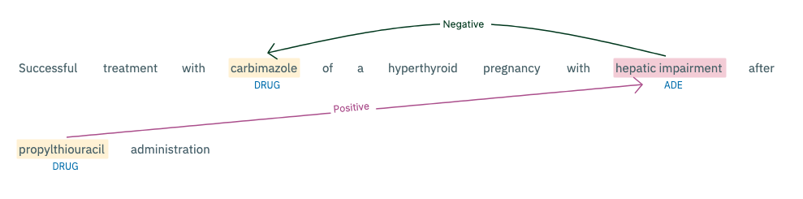
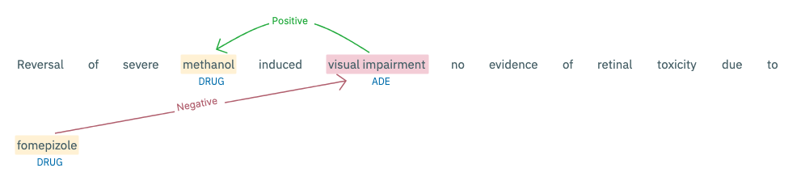
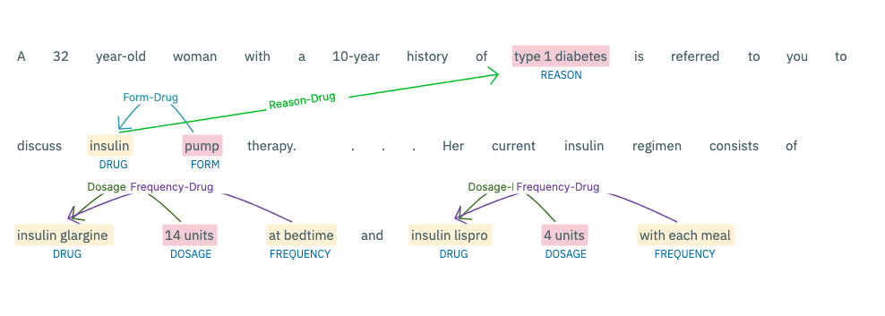

# Adverse Drug Event Detection Using NLP
[](https://paperswithcode.com/sota/relation-extraction-on-ade-corpus)

This repository contains resources related to the article **Improving Patient Safety through Natural Language Processing: Detecting Adverse Drug Events in Healthcare**.

## Article Summary

This article presents natural language processing (NLP) techniques like classification, named entity recognition (NER) and relation extraction (RE) to analyze healthcare data and detect adverse drug events (ADEs). It utilizes datasets like EHRs, social media posts, and clinical reports to train NLP models to identify drugs and associated side effects. The key findings include:

- Achieved state-of-the-art results for NER, RE, and classification tasks on benchmark datasets
  - NER F1 scores: 92.12 (ADE Corpus), 80.02 (CADEC), 78.58 (SMM4H)
  - RE F1 score: 85 (ADE Corpus)
  - Classification F1 scores: 93 (ADE Corpus), 89 (CADEC)
- Demonstrated NLP's potential for extracting insights from large-scale unstructured data to improve pharmacovigilance





## Repository Contents

This repository contains the following:

- **data/**: Example preprocessed data files from the datasets used
  - `ade_classification_sample.csv`: Sample labeled data from Classification
  - `ade_ner_sample.conll`: Sample labeled data from NER
  - `ade_relation_sample.csv`: Sample labeled data from Relation Extraction

- **models/**: Links to live demos of the NLP models
  - NER: [Model](https://huggingface.co/aimped/nlp-health-ner-ade-casereport-base-en)
  - RE: [Model](https://huggingface.co/aimped/nlp-health-relation-ade-medcaserep-base-en)
  - Classification: [Model](https://huggingface.co/aimped/nlp-health-classifier-ade-base-en)

- `article.pdf`: PDF version of the published article

Please note that the full datasets and trained models are not shared here due to licensing restrictions. Please refer to the article for details on the experimental setup. Feel free to use the example data for research purposes.

## Citation

```bibtex
@article{ADE,
  title={Improving Patient Safety through Natural Language Processing: Detecting Adverse Drug Events in Healthcare},
  author={Keles, Bunyamin and Hizlan, Raife and Smith, Joseph},
  journal={aimped.ai LLC, USA},
  year={2023}
}
