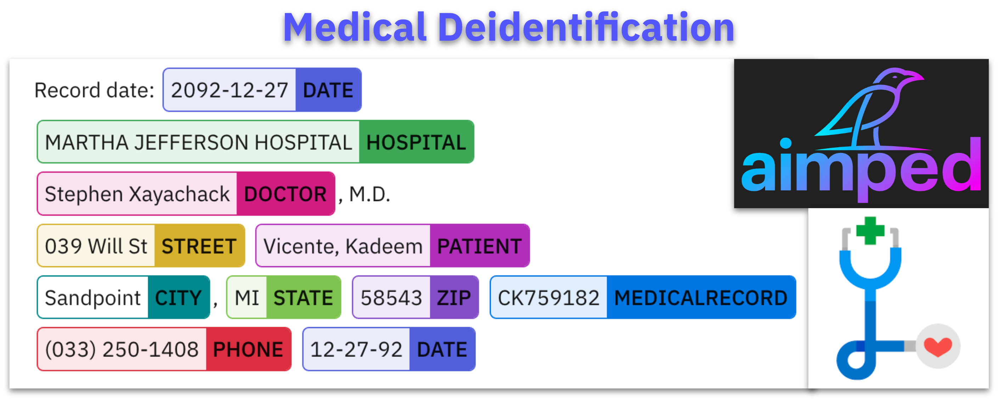
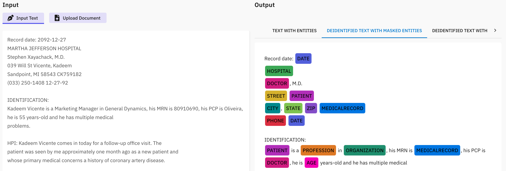
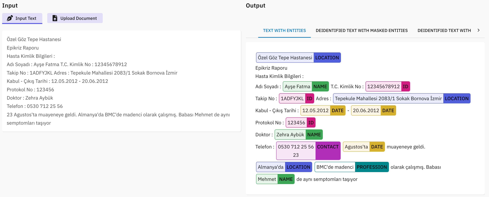
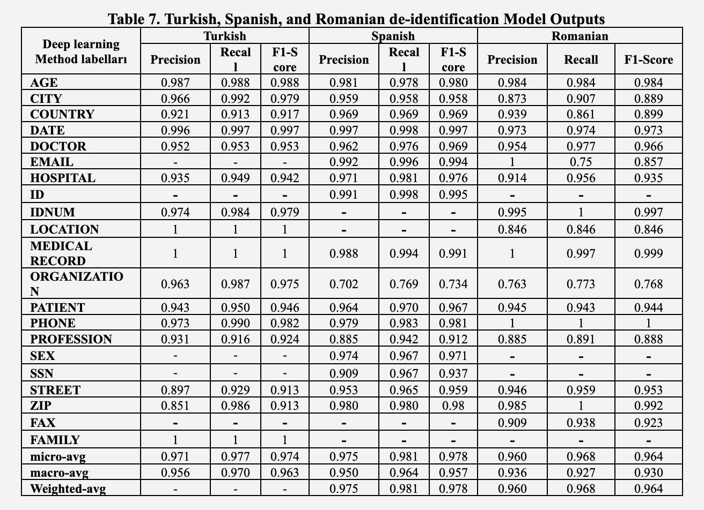
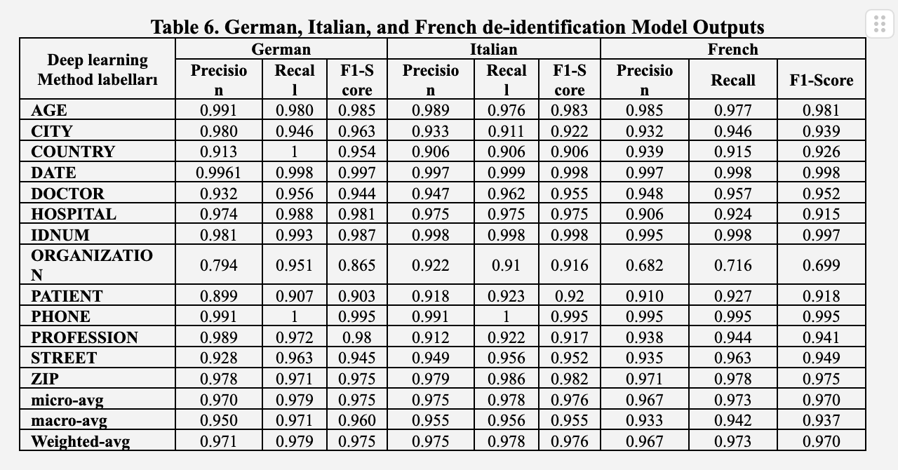

# Adverse Drug Event Detection Using NLP

This repository contains resources related to the article **Leveraging Transformers for Medical Text Anonymization:  De-identification of PHI in Multiple Languages**.

## Article Summary

In recent years, the increasing number of chronic diseases and pandemics such as COVID-19 have once again demonstrated the importance of processing patient information and researching new ways of treatment. However, protecting patient privacy is still one of the important principles of ensuring patient safety. It is a necessity to hide, de-identify or delete patient identity, which is among the information needed in scientific studies. There is no restriction on the use of anonymized patient information in studies. Clinicians and other researchers should act in this context. 

In this study, the methodology and findings of the de-identification models developed in seven different languages, namely English, German, Italian, French, Romanian, Turkish, Arabic and Spanish, are presented. The f1-score micro averages obtained as a result of the studies were 0.962, 0.975, 0.976, 0.970, 0.964, 0.974, 0.9530, 0.978, respectively.








## Repository Contents

This repository contains the following:

- **models/**: Links to checkpoints of the NLP models
  - English: [Model](https://huggingface.co/aimped/nlp-health-deidentification-sub-base-en)
  - German: [Model](https://huggingface.co/aimped/nlp-health-deidentification-sub-base-de)
  - Italian: [Model](https://huggingface.co/aimped/nlp-health-deidentification-sub-base-it)
  - French: [Model](https://huggingface.co/aimped/nlp-health-deidentification-sub-base-fr)
  - Romanian: [Model](https://huggingface.co/aimped/nlp-health-deidentification-sub-base-ro)
  - Turkish: [Model](https://huggingface.co/aimped/nlp-health-deidentification-sub-base-tr)
  - Arabic: [Model](https://huggingface.co/aimped/nlp-health-deidentification-sub-base-ar)
  - Spanish: [Model](https://huggingface.co/aimped/nlp-health-deidentification-sub-base-es)
- `article.pdf`: PDF version of the published article

Please refer to the article for details on the experimental setup.

## License
  - cc-by-nc-4.0

## Citation

```bibtex
@article{deid,
  title={Leveraging Transformers for Medical Text Anonymization:  De-identification of PHI in Multiple Languages},
  author={Keles, Bunyamin and Hizlan, Raife and Smith, Joseph},
  journal={aimped.ai LLC, USA},
  year={2023}
}
